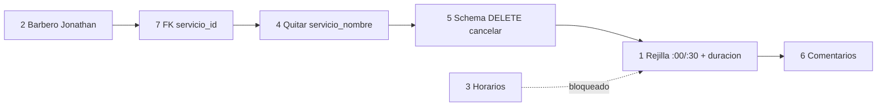

# Plan de mejoras — Backend Bulls Barber Shop

Documento de **próximos pasos** derivado de la auditoría (`docs/auditoria_26-05.md`).  
Prioriza lo acordado con el equipo y deja explícito lo que depende del dueño del negocio.

**Rama de referencia:** `main` @ `10e8ba6`

---

## Resumen rápido

| # | Tema | Estado | Prioridad |
|---|------|--------|-----------|
| 1 | Rejilla :00/:30 + `duracion_minutos` (defecto 30 min) | Por implementar | Alta |
| 2 | Barbero único — defecto **Jonathan** | Por implementar | Media |
| 3 | Horario de apertura y festivos | **Bloqueado** — hablar con el dueño | Alta (cuando haya datos) |
| 4 | Campo `servicio_nombre` en la API | Aclarar + limpiar contrato | Media |
| 5 | Cancelar reservas solo con `DELETE` | Documentar + alinear frontend/schema | Media |
| 6 | Comentarios en código | Refuerzo puntual | Baja |
| 7 | **FK** `bookings.servicio_id` → `services.id` | Por implementar | **Media-alta** |
| 8 | Otros (servicio inactivo en GET público, etc.) | Backlog | Baja |

---

## 1. Rejilla de citas (:00 / :30) y duración del servicio

### Regla de negocio acordada

Las reservas online siguen una **rejilla fija de 30 minutos**:

- Solo se puede reservar con **inicio a en punto o y media** (`:00` o `:30`).
- Cada cita ocupa un tramo continuo de **`duracion_minutos`** (por defecto **30**), contado desde ese inicio.
- **No** existen citas que empiecen a las 10:15, 10:45, etc.

| Inicio | Duración (defecto) | Tramo ocupado | ¿Permitido? |
|--------|-------------------|---------------|-------------|
| **10:00** | 30 min | 10:00 → 10:30 | Sí |
| **10:30** | 30 min | 10:30 → 11:00 | Sí |
| **10:15** | 30 min | 10:15 → 10:45 | **No** — no es un hueco de la rejilla |
| **11:00** | 30 min | 11:00 → 11:30 | Sí (siguiente hueco libre tras 10:00–10:30) |

Con un solo barbero (Jonathan) y servicios de 30 min, la agenda del día son huecos del estilo **10:00, 10:30, 11:00, 11:30…** El cliente elige uno de esos inicios; no elige “cualquier minuto”.

**Importante:** esto es lo que queréis operativamente. El backend **hoy no lo cumple**: acepta cualquier `fecha_hora` futura (p. ej. `10:15`) si no hay otra cita con el **mismo** instante exacto.

### Situación actual (código en `main`)

- Cada servicio tiene `duracion_minutos` en BD (por defecto **30** en el ORM), pero **no se usa** al bloquear el calendario.
- Solo se valida que `fecha_hora` sea futura y que no exista otra reserva activa con la **misma** `fecha_hora` (igualdad exacta, no intervalo ni rejilla).

### Objetivo técnico

1. **Rejilla:** rechazar reservas cuyos minutos no sean `00` ni `30` (segundos/microsegundos en 0).
2. **Intervalo:** cada reserva es `[inicio, inicio + duracion_minutos)`; impedir solape con citas **activas** (`pendiente` / `confirmada`).
3. **Duración:** leer `duracion_minutos` del servicio; si faltara, usar constante global **30** (`DEFAULT_SERVICE_DURATION_MINUTES`).
4. **Disponibilidad:** el calendario público solo ofrece / marca ocupados los inicios **:00** y **:30**; `GET /disponibilidad` alineado con esa rejilla.

### Comportamiento propuesto (detalle)

| Capa | Comportamiento |
|------|----------------|
| **Validación API** | `assert_slot_on_grid(fecha_hora, step_minutes=30)` → 422 si minutos ∉ {0, 30} |
| **Crear reserva** | `fin = inicio + duracion`; comprobar solape con todas las citas activas del día (o rango) |
| **Hueco libre** | Tras cita 10:00–10:30, el siguiente inicio reservable en rejilla es **10:30** (si no hay solape por servicios más largos) |
| **Servicios de más de 30 min** (futuro) | Definir con el dueño: p. ej. 45 min a las 10:00 bloquea 10:00 y 10:30 en la rejilla; dejar documentado antes de implementar |

### Pasos técnicos sugeridos

| Paso | Acción |
|------|--------|
| 1.1 | En `app/core/constants.py`: `DEFAULT_SERVICE_DURATION_MINUTES = 30`, `BOOKING_SLOT_STEP_MINUTES = 30` |
| 1.2 | En `app/domain/booking/rules.py`: `assert_slot_on_grid(fecha_hora)` y `intervals_overlap(...)` |
| 1.3 | Validador Pydantic en `BookingCreate` (o llamada desde router) que invoque `assert_slot_on_grid` |
| 1.4 | `is_slot_available(fecha_hora, duracion_minutos)` por solape de intervalos, no solo igualdad de timestamp |
| 1.5 | Pasar `duracion_minutos` del `Service` desde el router al crear |
| 1.6 | `get_slots_ocupados`: devolver inicios **:00/:30** ocupados ese día (compatible con frontend que deshabilita botones) |
| 1.7 | **Tests:** `10:15` → 422; `10:00` + `10:30` mismo día OK; `10:00` (30 min) + intento `10:30` con servicio 60 min → 409 según regla de duración |
| 1.8 | README: rejilla :00/:30, duración por servicio, sin reservas arbitrarias |
| 1.9 | Revisar índice único `0002` (solo protege mismo `fecha_hora`; la rejilla + solape queda en aplicación) |

### Configuración

- **Rejilla:** fija a 30 min entre huecos (`:00` / `:30`); no configurable de momento.
- **Duración por servicio:** `duracion_minutos` en admin (PUT `/api/services/{id}`) — ya editable; defecto **30**.
- **Frontend:** mostrar solo horas en punto y y media; no enviar `10:15` ni similares.

---

## 2. Barbero por defecto: Jonathan (un solo profesional)

### Situación actual

- Constante `DEFAULT_BARBER = "Cualquier barbero"` en `app/core/constants.py`.
- El cliente puede enviar otro nombre en `barbero`; si no envía nada, queda «Cualquier barbero».

### Objetivo de negocio

- De momento **solo hay un barbero** (Jonathan). Las reservas deben reflejarlo por defecto, sin pedir elegir barbero en la web pública.

### Pasos sugeridos

| Paso | Acción |
|------|--------|
| 2.1 | Cambiar `DEFAULT_BARBER` a `"Jonathan"` (unificar ortografía con el dueño: Jonathan / Jhonatan) |
| 2.2 | Actualizar `server_default` / migración opcional en `bookings.barbero` si se quiere coherencia en BD histórica |
| 2.3 | En `BookingCreate`, mantener `barbero` opcional pero documentar que el defecto es Jonathan; valorar **ocultar** el campo en el frontend |
| 2.4 | Emails en `booking_notifier.py` ya muestran barbero — seguirán mostrando «Jonathan» |
| 2.5 | README: una sola silla; sin agenda multi-barbero hasta nueva fase |

**Nota:** No hace falta entidad `Barber` ni conflictos por persona hasta que contraten a más gente.

---

## 3. Horario de apertura y festivos

### Estado: bloqueado — requiere reunión con el dueño

Antes de implementar hace falta concretar:

| Pregunta para el dueño | Ejemplo de respuesta |
|------------------------|----------------------|
| ¿Días de la semana abiertos? | Lun–Sáb |
| ¿Horario por día? | 10:00–14:00 y 16:00–20:00 |
| ¿Domingos / festivos cerrados? | Domingo cerrado; festivos lista manual |
| ¿Pausa comida fija? | Ya cubierta si hay dos franjas |
| ¿Antelación mínima para reservar? | p. ej. 2 horas antes |
| ¿Cuánto hacia el futuro se puede reservar? | p. ej. 60 días |

### Cuando haya respuestas — enfoque técnico (borrador)

| Paso | Acción |
|------|--------|
| 3.1 | Config en `app/config.py` o tabla `shop_settings` (JSON horarios por día de semana) |
| 3.2 | Validador en `rules.py`: `assert_within_opening_hours(fecha_hora, duracion)` |
| 3.3 | Lista de festivos (fichero, env o tabla admin) |
| 3.4 | Integrar en `BookingCreate` y en endpoint de disponibilidad |
| 3.5 | Tests con matriz de casos (sábado 21:30 → rechazado) |

**Hasta entonces:** no codificar horarios inventados; solo documentar esta sección como pendiente.

---

## 4. Campo `servicio_nombre` — qué pasa hoy y qué hacer

### Explicación clara

Al crear una reserva, el cliente envía un JSON como:

```json
{
  "servicio_id": 1,
  "servicio_nombre": "Corte VIP barato",
  "fecha_hora": "2030-12-01T10:00:00",
  ...
}
```

**Lo que hace el backend hoy** (`app/api/routers/bookings.py`):

1. Lee `servicio_id`.
2. Busca el servicio en base de datos.
3. Si no existe o no está activo → **400**.
4. Construye la reserva con `servicio_nombre = service.nombre` (**desde BD**).
5. **Ignora por completo** el `servicio_nombre` del JSON.

Por tanto:

- El nombre guardado y el que ve el admin **siempre** es el del catálogo, no el del formulario.
- Un usuario malintencionado **no puede** falsear el nombre en BD enviando otro texto en el payload.
- El problema **no es de seguridad**, sino de **contrato de API engañoso**: Swagger/OpenAPI y el frontend pueden creer que `servicio_nombre` es necesario o editable, y generan código muerto.

### Por qué existía el campo

- Histórico: antes el nombre podía venir solo del cliente sin validar servicio.
- Tras el refactor, la **fuente de verdad** es `servicio_id` + tabla `services`.

### Pasos recomendados

| Paso | Acción | Quién |
|------|--------|--------|
| 4.1 | **Backend:** eliminar `servicio_nombre` de `BookingCreate` (schema Pydantic) | Dev backend |
| 4.2 | **Frontend:** dejar de enviar `servicio_nombre` en el POST; mostrar nombre leyendo `GET /api/services` | Dev frontend |
| 4.3 | Mantener `servicio_nombre` en `BookingOut` y en BD (desnormalizado para listados/CSV/emails sin join) | — |
| 4.4 | Actualizar tests/helpers `booking_payload()` quitando `servicio_nombre` opcional | Dev backend |

**Alternativa mínima:** mantener el campo pero marcarlo `deprecated` en la descripción de OpenAPI y documentar «ignorado; solo informativo». Menos limpio que quitarlo.

---

## 5. Cancelar reservas: usar `DELETE`, no `PATCH`

### Comportamiento actual

| Acción | Endpoint | Resultado |
|--------|----------|-----------|
| Cancelar (correcto) | `DELETE /api/bookings/{id}` | **204** — soft-delete (`deleted_at` + `estado=cancelada`) |
| Intentar cancelar por PATCH | `PATCH /api/bookings/{id}` con `{"estado": "cancelada"}` | **400** — mensaje: *«Para cancelar una reserva usa DELETE…»* |

Motivo: solo `DELETE` ejecuta `CancelBookingUseCase` → `repo.delete()` con soft-delete consistente. Un `PATCH` con `cancelada` dejaría la fila sin `deleted_at` o mezclaría dos semánticas.

### Cambios a aplicar

| Paso | Acción |
|------|--------|
| 5.1 | **Frontend / panel admin:** botón «Cancelar» debe llamar a `DELETE`, no a `PATCH` |
| 5.2 | **Schema:** quitar `"cancelada"` de `BookingUpdate.estado` (`Literal` solo `pendiente`, `confirmada`, `completada`) para que OpenAPI no invite al error |
| 5.3 | **README** (ya parcialmente): una línea visible «Cancelar = DELETE» |
| 5.4 | Test de regresión ya existe: `test_patch_cancelada_rechazado_400` |

### Estados que sí van por `PATCH`

- `pendiente` → `confirmada`
- `confirmada` → `completada` (cuando el admin termina el servicio)
- Actualizar `notas` o `barbero`

---

## 6. Dónde mejorar comentarios en el código

No hace falta comentar todo; solo **decisiones de negocio o no obvias**. Archivos concretos:

| Archivo | Qué documentar (sugerencia de comentario) |
|---------|-------------------------------------------|
| `app/domain/booking/rules.py` | Rejilla solo `:00`/`:30`; `BOOKING_ACTIVE_STATES`; intervalos `[inicio, inicio+duración)`; UTC y fechas naive |
| `app/domain/booking/use_cases.py` | Transiciones permitidas; por qué `cancelada` no se acepta en `UpdateBookingUseCase` |
| `app/api/routers/bookings.py` | Bloque «validación de servicio en router»: fuente de verdad BD; por qué no se usa `servicio_nombre` del body |
| `app/infrastructure/persistence/repositories/booking.py` | Tras implementar duración: cómo se calcula solape; relación con índice `0002` |
| `app/infrastructure/persistence/repositories/stats.py` | Por qué `_distribucion_por_estado` **no** filtra `deleted_at` (historial de canceladas en dashboard) |
| `app/core/constants.py` | `DEFAULT_BARBER`, `DEFAULT_SERVICE_DURATION_MINUTES`, `BOOKING_SLOT_STEP_MINUTES` (30) |
| `app/api/schemas/booking.py` | En `BookingUpdate`: estados permitidos y remisión a DELETE para cancelar |
| `app/config.py` | Placeholder futuro `SHOP_OPENING_HOURS` o referencia a doc de plan pendiente con el dueño |

**Ya bien comentados (mantener estilo, no duplicar):**

- `app/api/routers/gallery.py`
- `app/api/routers/health.py`
- `app/core/rate_limit.py`
- Cabecera de `app/infrastructure/persistence/repositories/booking.py` (soft-delete)

---

## 7. Integridad referencial: FK reservas → servicios

### Por qué sube de prioridad

En `0001` la tabla `bookings` tiene `servicio_id` **sin foreign key**. Si el admin hace `DELETE /api/services/{id}`:

- El servicio desaparece de `services`.
- Las reservas siguen en BD con ese `servicio_id` y el `servicio_nombre` desnormalizado.
- Listados, CSV y emails pueden **parecer** correctos, pero los datos están **huérfanos** (joins rotos, stats/incoherencias futuras).

Es una **migración pequeña** con mucho impacto en integridad; conviene hacerla **antes o junto** a los cambios rápidos de contrato, no dejarla en backlog lejano.

### Comportamiento deseado

| Acción | Comportamiento recomendado |
|--------|---------------------------|
| Borrar servicio con reservas asociadas | **Bloquear** (`ON DELETE RESTRICT`) o devolver error claro desde la API |
| Retirar servicio del catálogo público | Usar `activo=false` (PUT), no DELETE |
| Reservas históricas | Siguen apuntando a un `servicio_id` válido |

### Pasos técnicos

| Paso | Acción |
|------|--------|
| 7.1 | Migración Alembic `0003_bookings_service_fk.py`: `op.create_foreign_key(..., ondelete='RESTRICT')` |
| 7.2 | Antes de aplicar en prod: comprobar que no hay `servicio_id` huérfanos (`alembic upgrade` tras script de limpieza si hiciera falta) |
| 7.3 | Capturar violación de FK en **repositorio** → excepción de dominio → **409** en router (ver detalle abajo) |
| 7.4 | Tests de integración: DELETE con reservas → error; `activo=false` con reservas → OK (ver detalle abajo) |
| 7.5 | README / panel admin: preferir desactivar servicio frente a borrar si hay citas |

**Esfuerzo estimado:** ~30–60 min (migración + PRAGMA SQLite + excepción de dominio + tests).

#### Paso 7.1 — Migración y matiz SQLite

- **PostgreSQL (prod):** `ON DELETE RESTRICT` se aplica al crear la FK; un `DELETE` sobre `services` con reservas referenciadas falla en BD.
- **SQLite:** las FK existen desde 3.6+, pero van **desactivadas por defecto**. Hay que ejecutar `PRAGMA foreign_keys = ON` en **cada conexión**.
- En `app/database.py` **no** está ese PRAGMA hoy → en dev, aunque Alembic cree la FK, la restricción **no se aplicará** hasta configurarlo.

**Opciones (elegir una al implementar):**

1. **Recomendada:** añadir en `database.py` algo equivalente a:
   ```python
   @event.listens_for(engine, "connect")
   def _set_sqlite_pragma(dbapi_conn, connection_record):
       if "sqlite" in settings.DATABASE_URL:
           cursor = dbapi_conn.cursor()
           cursor.execute("PRAGMA foreign_keys=ON")
           cursor.close()
   ```
   Así dev y tests con SQLite respetan la misma regla que prod.

2. **Alternativa:** aceptar que la FK solo opera en PostgreSQL y documentarlo; entonces el test 7.4 no debe confiar solo en SQLite en memoria sin PRAGMA (usar integración con FK activa o mock del repositorio + test del camino de excepción de dominio).

#### Paso 7.3 — Dónde capturar el error (patrón como `SlotOcupado`)

| Capa | Responsabilidad |
|------|-----------------|
| **Repositorio** (`SQLAlchemyServiceRepository.delete`) | `try/except IntegrityError` → `rollback` → lanzar excepción de dominio |
| **Dominio** (`app/domain/service/ports.py`) | Nueva excepción, p. ej. `ServiceHasBookings` («No se puede eliminar: hay reservas vinculadas») |
| **Caso de uso** | Propagar sin tragar (o no capturar nada extra) |
| **Router** (`DELETE /api/services/{id}`) | `except ServiceHasBookings` → `HTTPException(409, detail=...)` |

No devolver strings crudos de SQLAlchemy al cliente. Mismo criterio que `SlotOcupado` / `IntegrityError` en reservas.

Mensaje orientado al admin: *«Hay reservas vinculadas. Desactiva el servicio (activo=false) en lugar de eliminarlo.»*

#### Paso 7.4 — Tests

| Caso | Esperado |
|------|----------|
| Servicio con al menos una reserva → `DELETE` servicio | **409** (o `ServiceHasBookings` en unitario del repo) |
| Servicio con reservas → `PUT` con `activo: false` | **200** — camino feliz del día a día del admin |
| Servicio sin reservas → `DELETE` | **204** |

El segundo caso es el que **realmente usará el admin**; debe quedar cubierto explícitamente para no romper el flujo al añadir la FK.

---

## 8. Backlog (auditoría, resto)

| Tema | Notas |
|------|--------|
| `GET /services/{id}` e inactivos | Ver subsección siguiente |
| Validar `completada` solo si la cita ya pasó (opcional) | Evitar completar citas futuras por error |
| Rate limit con Redis | Solo si hay varias instancias |
| `POST /contact/` con `response_model` tipado | Consistencia OpenAPI |

### `GET /services/{id}` — público vs admin (cuando se implemente)

- **Ruta pública** (sin JWT): si el servicio existe pero `activo=false` → **404** (mismo criterio que «no existe» para el cliente).
- **Admin** (con JWT): el mismo `GET /api/services/{id}` con token debe **seguir devolviendo** el servicio inactivo, para que el panel pueda verlo y **reactivarlo** (`activo=true` vía PUT).
- Hoy `obtener_servicio` no distingue; al implementar, reutilizar el patrón de `listar_servicios` (`get_optional_admin` / `get_current_admin`) o un query param explícito solo para admin — pero **no** ocultar inactivos al admin en el detalle.

---

## 9. Orden de implementación recomendado



1. **Rápido (1–2 h):** Jonathan por defecto + **migración FK `0003`** + manejo 409 al borrar servicio con reservas + limpiar `servicio_nombre` del create + quitar `cancelada` del PATCH schema + comentarios cortos en `rules.py` y `bookings.py`.
2. **Medio (1–2 días):** rejilla :00/:30 + duración por intervalos + tests + calendario frontend (solo en punto y y media).
3. **Con el dueño:** horarios y festivos → luego validación en `rules.py`.

---

## 10. Checklist para el frontend

- [ ] Cancelar cita: `DELETE /api/bookings/{id}`, no PATCH con `cancelada`
- [ ] Crear cita: no enviar `servicio_nombre`; solo `servicio_id`
- [ ] No mostrar selector de barbero (o fijar Jonathan en UI)
- [ ] Calendario: **solo** huecos en **:00** y **:30** (no 10:15 ni minutos libres)
- [ ] Tras backend: deshabilitar huecos ocupados según `GET /disponibilidad` y duración del servicio elegido
- [ ] No permitir enviar `fecha_hora` fuera de la rejilla (el API devolverá 422)
- [ ] Pendiente: respetar horario del local cuando exista configuración

---

*Documento vivo — actualizar cuando el dueño confirme horarios o se complete cada ítem.*
